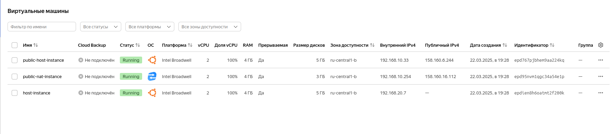
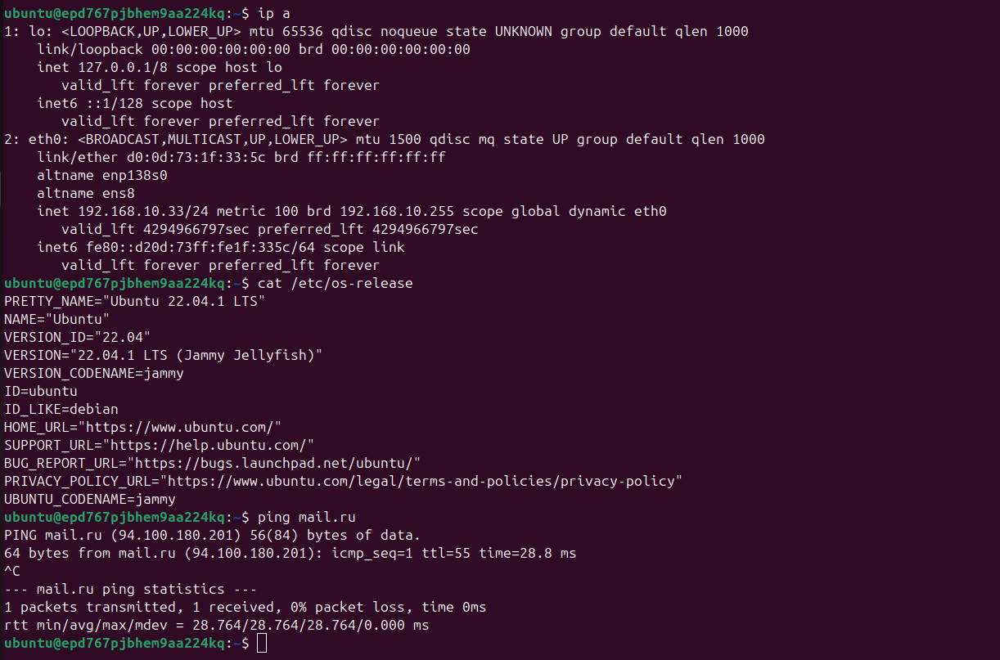
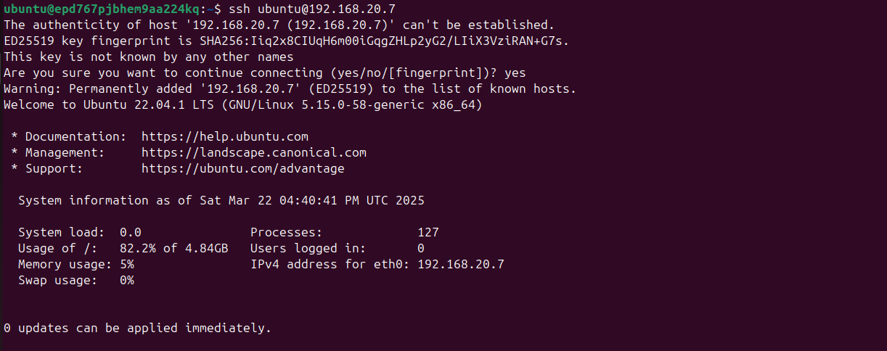
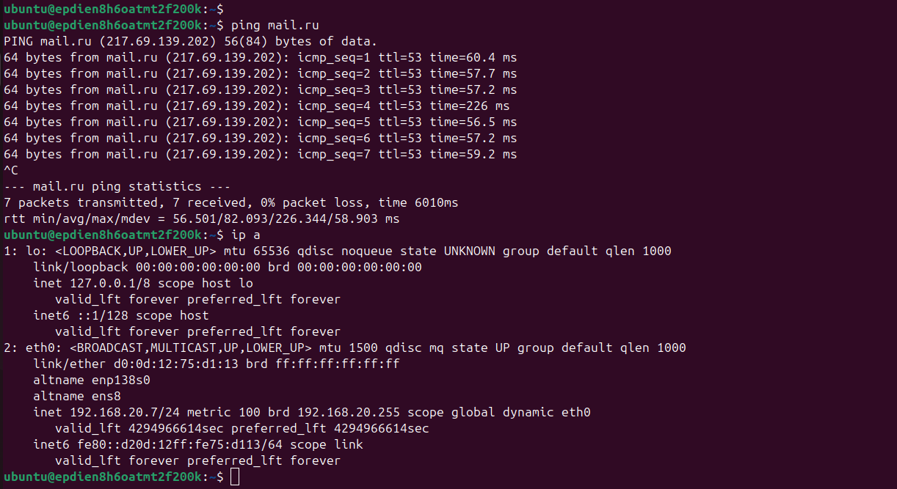

1. Route table:

[Route table](main.tf)

resource "yandex_vpc_route_table" "privat-rt" {
  network_id = yandex_vpc_network.netology-net.id

  static_route {
    destination_prefix = "0.0.0.0/0"
    next_hop_address = "192.168.10.254"
  }
}

2. Configuration files:

[Private part](private-vm.tf)

[Public part](public-vm.tf)

[Variables](variables.tf)

3. VMs:

4. Public VM:

5.Connection to Private VM:

6.Private VM:

